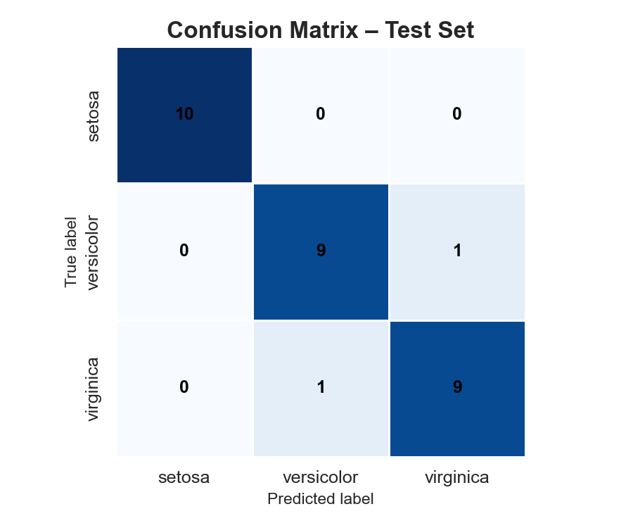
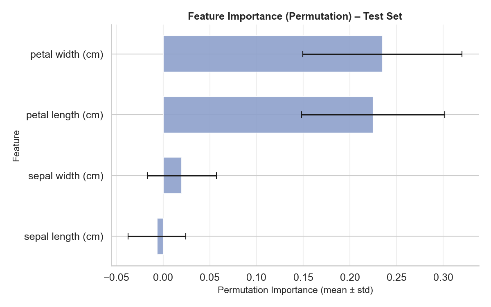
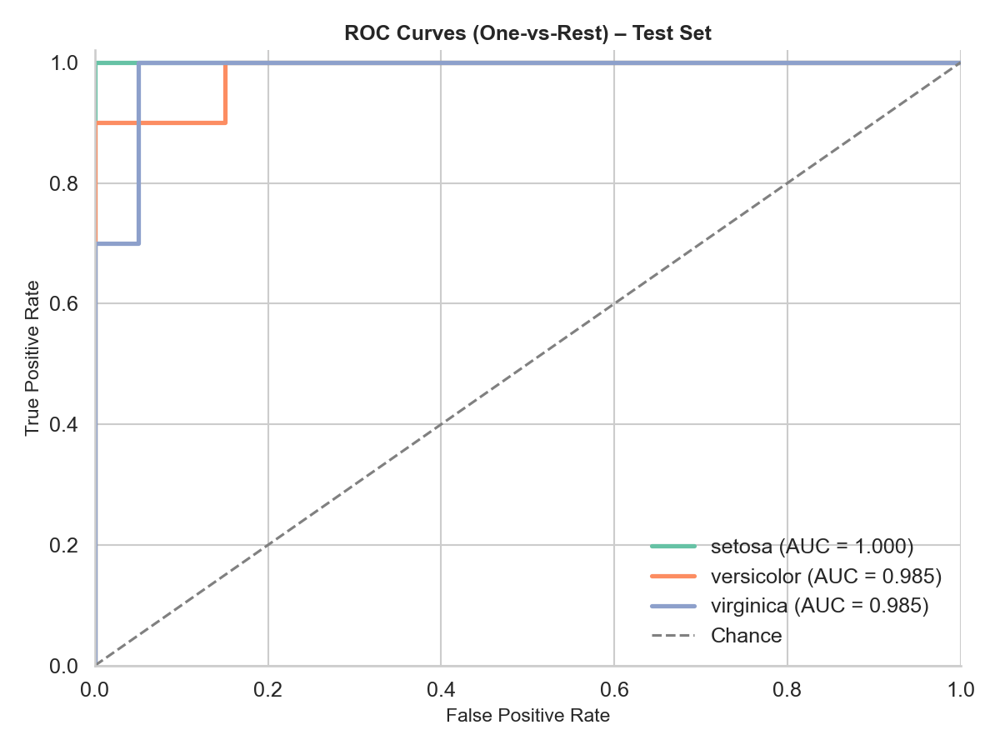

# Iris Flower Classification

This project demonstrates a complete machine learning pipeline on the classic [Iris dataset](https://scikit-learn.org/stable/datasets/toy_dataset.html#iris-dataset), implemented with **scikit-learn**.

The project includes:
- Exploratory Data Analysis (EDA) with styled plots.
- Model comparison with cross-validation.
- Hyperparameter tuning using `GridSearchCV`.
- Evaluation on a test set (accuracy, balanced accuracy, classification report).
- Confusion matrix, ROC curves, learning curve, and permutation importance plots.
- Model saving for later inference.

## Repository structure
```
.
├── iris_classification.ipynb   # Notebook with EDA, training, results
├── main.py                     # Production-style script with CLI flags
├── models/                     # Saved model artifacts
├── reports/
│   ├── figures/                # Generated plots
│   └── ...                     # Evaluation outputs
├── requirements.txt            # Dependencies
├── LICENSE
└── README.md
```

## Quickstart
```bash
pip install -r requirements.txt
python main.py --plots --with-roc --with-learning-curve --with-permutation-importance --save-model
```

## Example Outputs




## Requirements
- Python 3.9+
- scikit-learn, pandas, numpy, matplotlib, seaborn, joblib

## License
This project is licensed under the MIT License. See [LICENSE](LICENSE) for details.
